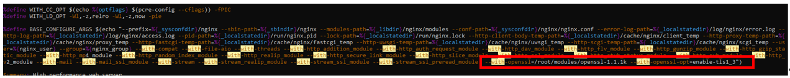
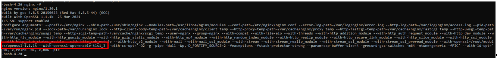

##	ДЗ к занятию 6.
Размещаем свой RPM в своем репозитории
1. создать свой RPM (можно взять свое приложение, либо собрать к примеру апач с определенными опциями)
2. создать свой репо и разместить там свой RPM реализовать это все либо в вагранте, либо развернуть у себя через nginx и дать ссылку на репо

### Примечание.
В файле Vagrant в созданный репозиторий будут помещены следующие пакеты:
	nginx-1.20.1-1.el7.ngx.x86_64.rpm c модулем openssl-1.1.1k
	percona-release-0.1-6.noarch.rpm
	httpd-2.4.6-97.el7.centos.x86_64.rpm

В данном описании приводится пример размещения пакетов сервера 1С и nginx-1.20.1-1.el7.ngx.x86_64.rpm c модулем openssl-1.1.1k

##	1.Сборка nginx из исходных кодов.
### 1.1. Устанавливаем доп. пакеты.
	yum install -y rpm-build rpmdevtools yum-utils openssl-devel zlib-devel pcre-devel redhat-lsb-core createrepo
	  
### 1.2. создадим пользователя builder. Опция -m сразу создаст домашний каталог для пользователя.
	[root@vmrepo ~]# useradd builder -m

### 1.3. Переходим в домашний каталог root
	[root@vmrepo ~]# cd ~

### 1.4. Создадим структуру каталогов для сборки и посмотрим что создано:
	[root@vmrepo ~]$ rpmdev-setuptree
	
### 1.5. Скачиваем файл nginx-1.20.1-1.el7.ngx.src.rpm  в папку /root с сайта разработчика
	[root@vmrepo SRC]# wget http://nginx.org/packages/centos/7/SRPMS/nginx-1.20.1-1.el7.ngx.src.rpm 
		 
### 1.5. Установим скачанный исходник командой:
	rpm -Uvh nginx-1.20.1-1.el7.ngx.src.rpm

### 1.8. Проверяем наличие развернутого исходного кода в rpmbuild/SOURCES
	[root@vmrepo ~]$ ls -al rpmbuild/SOURCES
	total 1092
	drwxrwxr-x. 2 root root    4096 May 20 09:31 .
	drwxrwxr-x. 7 root root      72 May 20 09:20 ..
	-rw-r--r--. 1 root root     351 Apr 13 18:48 logrotate
	-rw-r--r--. 1 root root 1061062 Apr 13 18:34 nginx-1.20.1.tar.gz
	-rwxr-xr-x. 1 root root     646 Apr 13 18:48 nginx.check-reload.sh
	-rw-r--r--. 1 root root     643 Apr 13 18:48 nginx.conf
	-rw-r--r--. 1 root root    1377 Apr 13 18:48 nginx.copyright
	-rw-r--r--. 1 root root     475 Apr 13 18:48 nginx-debug.service
	-rw-r--r--. 1 root root     148 Apr 13 18:48 nginx-debug.sysconf
	-rw-r--r--. 1 root root    1093 Apr 13 18:48 nginx.default.conf
	-rwxr-xr-x. 1 root root    3655 Apr 13 18:48 nginx.init.in
	-rw-r--r--. 1 root root     469 Apr 13 18:48 nginx.service
	-rw-r--r--. 1 root root     355 Apr 13 18:48 nginx.suse.logrotate
	-rw-r--r--. 1 root root      98 Apr 13 18:48 nginx.sysconf
	-rw-r--r--. 1 root root     906 Apr 13 18:48 nginx.upgrade.sh

### 1.9. Собираем установочный RPM-пакет:
	 rpmbuild -ba rpmbuild/SPECS/nginx.spec
	...
	Executing(%clean): /bin/sh -e /var/tmp/rpm-tmp.ybId6q
	+ umask 022
	+ cd /root/rpmbuild/BUILD
	+ cd nginx-1.20.1
	+ /usr/bin/rm -rf /root/rpmbuild/BUILDROOT/nginx-1.20.1-1.el7.ngx.x86_64
	+ exit 0

### 1.10. Сборка пакета завершена. Проверяем что получилось.
	[root@vmrepo ~]$ ls -al rpmbuild/RPMS/x86_64/
	total 2584
	drwxr-xr-x. 2 root root     100 May 20 09:44 .
	drwxrwxr-x. 3 root root      20 May 20 09:44 ..
	-rw-rw-r--. 1 root root  810724 May 20 09:44 nginx-1.20.1-1.el7.ngx.x86_64.rpm
	-rw-rw-r--. 1 root root 1834012 May 20 09:44 nginx-debuginfo-1.20.1-1.el7.ngx.x86_64.rpm

### 1.11. Проверяем установлен nginx на данной ВМ
	[root@vmrepo SRC]# rpm -qa | grep nginx*
	[root@vmrepo SRC]#
	
	nginx не установлен.
	
### 1.12. Устанавливаем nginx на ВМ
	[root@vmrepo SRC]# rpm -ivh /root/rpmbuild/RPMS/x86_64/nginx-1.20.1-1.el7.ngx.x86_64.rpm
	Preparing...                          ################################# [100%]
	Updating / installing...
	   1:nginx-1:1.20.1-1.el7.ngx        ################################# [100%]
	----------------------------------------------------------------------

	Thanks for using nginx!

### 1.13. Запускаем nginx и проверяем что он работает.
	[root@vmrepo SRC]# systemctl status nginx
	● nginx.service - nginx - high performance web server
	   Loaded: loaded (/usr/lib/systemd/system/nginx.service; disabled; vendor preset: disabled)
	   Active: inactive (dead)
		 Docs: http://nginx.org/en/docs/
		 
	[root@vmrepo SRC]# systemctl start nginx
	
	[root@vmrepo SRC]# systemctl status nginx
	● nginx.service - nginx - high performance web server
	   Loaded: loaded (/usr/lib/systemd/system/nginx.service; disabled; vendor preset: disabled)
	   Active: active (running) since Thu 2021-05-20 09:54:13 MSK; 2s ago
		 Docs: http://nginx.org/en/docs/
	  Process: 14321 ExecStart=/usr/sbin/nginx -c /etc/nginx/nginx.conf (code=exited, status=0/SUCCESS)
	 Main PID: 14322 (nginx)
	   CGroup: /system.slice/nginx.service
			   ├─14322 nginx: master process /usr/sbin/nginx -c /etc/nginx/nginx.conf
			   └─14323 nginx: worker process

	[root@vmrepo SRC]# curl http://localhost
		<!DOCTYPE html>
		<html>
		<head>
		<title>Welcome to nginx!</title>
		
		</head>
		<body>
		<h1>Welcome to nginx!</h1>
		
If you see this page, the nginx web server is successfully installed and
		working. Further configuration is required.

		
For online documentation and support please refer to
		<a href="http://nginx.org/">nginx.org</a>. 
		Commercial support is available at
		<a href="http://nginx.com/">nginx.com</a>.

		
<em>Thank you for using nginx.</em>

		</body>
		</html>
		[root@vmrepo SRC]#

Nginx работает.

### 1.14. Смотрим полное название установленного в системе пакета:
	[root@vmrepo SRC]# rpm -qa | grep nginx
	nginx-1.20.1-1.el7.ngx.x86_64

### 1.15. Удаляем установленный nginx с ВМ
	[root@vmrepo SRC]# rpm -e nginx-1.20.1-1.el7.ngx.x86_64
	[root@vmrepo SRC]# rpm -qa | grep nginx
	[root@vmrepo SRC]#
	

## 2. Сборка nginx с модулем OpenSSL.

### 2.1. Скачиваем и разархивируем крайнюю версию openssl.
	[root@vmrepo ~]$ wget https://www.openssl.org/source/latest.tar.gz
	[root@vmrepo ~]$ tar -xvf latest.tar.gz

Имеем:

	[root@vmrepo ~]$ ls -al modules/
	total 4
	drwxrwxr-x.  4 root root   65 May 20 16:39 .
	drwx------.  5 root root  183 May 20 10:34 ..
	drwxrwxr-x. 19 root root 4096 May 20 16:33 openssl-1.1.1k

### 2.3. Редоктируем файл nginx.spec
	[root@vmrepo ~] vi rpmbuild/SPECS/nginx.spec

Добавляем в строку, начинающуюся с %define BASE_CONFIGURE_ARGS в самый конец к списку параметров: --with-openssl=/root/modules/openssl-1.1.1k --with-openssl-opt=enable-tls1_3

 

### 2.4. Выполняем сборку rpm пакета nginx с модулем openssl

	[root@vmrepo ~]$ rpmbuild -ba rpmbuild/SPECS/nginx.spec
	Executing(%clean): /bin/sh -e /var/tmp/rpm-tmp.Ibl8VW
	+ umask 022
	+ cd /root/rpmbuild/BUILD
	+ cd nginx-1.20.1
	+ /usr/bin/rm -rf /root/rpmbuild/BUILDROOT/nginx-1.20.1-1.el7.ngx.x86_64
	+ exit 0

### 2.5. Пакет собран. Проверяем
	[root@vmrepo ~]$ ls -al rpmbuild/RPMS/x86_64
	total 4104
	drwxr-xr-x. 2 root root     100 May 20 16:36 .
	drwxrwxr-x. 3 root root      20 May 20 09:44 ..
	-rw-rw-r--. 1 root root 2200036 May 20 16:36 nginx-1.20.1-1.el7.ngx.x86_64.rpm
	-rw-rw-r--. 1 root root 1996300 May 20 16:36 nginx-debuginfo-1.20.1-1.el7.ngx.x86_64.rpm

### 2.5. Устанавлиаем и запускаем nginx.
	[root@vmrepo x86_64]# rpm -ivh nginx-1.20.1-1.el7.ngx.x86_64.rpm
	Preparing...                          ################################# [100%]
	Updating / installing...
	   1:nginx-1:1.20.1-1.el7.ngx        ################################# [100%]

	[root@vmrepo x86_64]# systemctl start nginx
	
	[root@vmrepo x86_64]# systemctl status nginx
	● nginx.service - nginx - high performance web server
	   Loaded: loaded (/usr/lib/systemd/system/nginx.service; disabled; vendor preset: disabled)
	   Active: active (running) since Thu 2021-05-20 16:47:43 MSK; 5s ago
		 Docs: http://nginx.org/en/docs/
	  Process: 14722 ExecStart=/usr/sbin/nginx -c /etc/nginx/nginx.conf (code=exited, status=0/SUCCESS)
	 Main PID: 14723 (nginx)
	   CGroup: /system.slice/nginx.service
			   ├─14723 nginx: master process /usr/sbin/nginx -c /etc/nginx/nginx.conf
			   └─14724 nginx: worker process

### 2.6. Проверяем наличие openssl-1.1.1k выполняя команду nginx -V.

## 3. Создание собственного репозитория.

В создаваемый репозиторий будем размещать следующие пакеты:

    [root@vmrepo rpm]# ls -al
    total 245196
    drwxr-xr-x. 2 vagrant vagrant      4096 май 20 18:56 .
    drwx------. 4 vagrant vagrant       106 май 20 18:55 ..
    -rw-rw-rw-. 1 vagrant vagrant  32224945 май 26  2015 1C_Enterprise83-common-8.3.6-2041.x86_64.rpm
    -rw-rw-rw-. 1 vagrant vagrant   1538272 май 26  2015 1C_Enterprise83-common-nls-8.3.6-2041.x86_64.rpm
    -rw-rw-rw-. 1 vagrant vagrant 161377345 май 26  2015 1C_Enterprise83-server-8.3.6-2041.x86_64.rpm
    -rw-rw-rw-. 1 vagrant vagrant  53525865 май 26  2015 1C_Enterprise83-server-nls-8.3.6-2041.x86_64.rpm
    -rw-rw-rw-. 1 vagrant vagrant    183312 май 26  2015 1C_Enterprise83-ws-8.3.6-2041.x86_64.rpm
    -rw-rw-rw-. 1 vagrant vagrant     15250 май 26  2015 1C_Enterprise83-ws-nls-8.3.6-2041.x86_64.rpm
    -rw-r--r--. 1 vagrant vagrant   2200036 май 20 18:44 nginx-1.20.1-1.el7.ngx.x86_64.rpm

### 3.1. Создаем каталог для репозитория.
    [root@vmrepo rpm]# mkdir -p /usr/share/nginx/html/repo

### 3.2. Копируем пакеты в репозиторий.
    [root@vmrepo rpm]# mkdir -p /usr/share/nginx/html/repo

### 3.3. Инициализируем репозиторий.

    createrepo /usr/share/nginx/html/repo/
    Spawning worker 0 with 7 pkgs
    Workers Finished
    Saving Primary metadata
    Saving file lists metadata
    Saving other metadata
    Generating sqlite DBs
    Sqlite DBs complete

### 3.4. Добавляем директиву autoindex в /etc/nginx/nginx.conf
        location / {
        root   /usr/share/nginx/html;
        index  index.html index.htm;
        autoindex on;
    }

### 3.5. Проверяем измененную конфигурацию
    [root@vmrepo rpm]# nginx -t
    nginx: the configuration file /etc/nginx/nginx.conf syntax is ok
    nginx: configuration file /etc/nginx/nginx.conf test is successful

### 3.6. Даем команду перечетать и применить измененную конфигурацию.
    [root@vmrepo rpm]# nginx -s reload

### 3.7. Проверяем.

    [root@vmrepo rpm]# curl -a  http://192.168.11.101/repo/
    <html>
    <head><title>Index of /repo/</title></head>
    <body>
    <h1>Index of /repo/</h1>
<pre><a href="../">../</a>
    <a href="repodata/">repodata/</a>                                          20-May-2021 19:04                   -
    <a href="1C_Enterprise83-common-8.3.6-2041.x86_64.rpm">1C_Enterprise83-common-8.3.6-2041.x86_64.rpm</a>       20-May-2021 19:00            32224945
    <a href="1C_Enterprise83-common-nls-8.3.6-2041.x86_64.rpm">1C_Enterprise83-common-nls-8.3.6-2041.x86_64.rpm</a>   20-May-2021 19:00             1538272
    <a href="1C_Enterprise83-server-8.3.6-2041.x86_64.rpm">1C_Enterprise83-server-8.3.6-2041.x86_64.rpm</a>       20-May-2021 19:00           161377345
    <a href="1C_Enterprise83-server-nls-8.3.6-2041.x86_64.rpm">1C_Enterprise83-server-nls-8.3.6-2041.x86_64.rpm</a>   20-May-2021 19:00            53525865
    <a href="1C_Enterprise83-ws-8.3.6-2041.x86_64.rpm">1C_Enterprise83-ws-8.3.6-2041.x86_64.rpm</a>           20-May-2021 19:00              183312
    <a href="1C_Enterprise83-ws-nls-8.3.6-2041.x86_64.rpm">1C_Enterprise83-ws-nls-8.3.6-2041.x86_64.rpm</a>       20-May-2021 19:00               15250
    <a href="nginx-1.20.1-1.el7.ngx.x86_64.rpm">nginx-1.20.1-1.el7.ngx.x86_64.rpm</a>                 20-May-2021 19:00             2200036
    </pre>
</body>
    </html>

### 3.8. Создаем файл с описанием репозитория.
    [root@vmrepo rpm]# cat >> /etc/yum.repos.d/otus.repo << EOF 
    [otus]
    name=otus-linux
    baseurl=http://192.168.11.201/repo
    gpgcheck=0
    enabled=1
    EOF

## Подымаем вторую ВМ и выполняем установку пакетов.

    [root@vmrepo log]# ip addr
    3: eth1: <BROADCAST,MULTICAST,UP,LOWER_UP> mtu 1500 qdisc pfifo_fast state UP group default qlen 1000
        link/ether 08:00:27:50:bc:a0 brd ff:ff:ff:ff:ff:ff
        inet 192.168.11.201/24 brd 192.168.11.255 scope global noprefixroute eth1
        valid_lft forever preferred_lft forever
        inet6 fe80::a00:27ff:fe50:bca0/64 scope link 
        valid_lft forever preferred_lft forever

       [root@vmrepo log]# yum repolist
        Загружены модули: fastestmirror
        Loading mirror speeds from cached hostfile
        * base: mirror.reconn.ru
        * extras: mirrors.datahouse.ru
        * updates: centos-mirror.rbc.ru
        Идентификатор репозитория       репозиторий`          состояние
        base/7/x86_64                  CentOS-7 - Base         10 072
        extras/7/x86_64                CentOS-7 - Extras        476
        otus                           otus-linux                7
        updates/7/x86_64               CentOS-7 - Updates      2 189
        repolist: 12 744
    
       
       
### Устанавливанию пакеты 1С сервера.

    yum install 1C_Enterprise*
    
    Общий размер                                                                                                                                                                                               116 MB/s | 237 MB  00:00:02     
    Running transaction check
    Running transaction test
    Transaction test succeeded
    Running transaction
    Установка   : 1C_Enterprise83-common-8.3.6-2041.x86_64                                                                                                                                                                               1/6 
    Установка   : 1C_Enterprise83-server-8.3.6-2041.x86_64                                                                                                                                                                               2/6 
    Установка   : 1C_Enterprise83-ws-8.3.6-2041.x86_64                                                                                                                                                                                   3/6 
    Установка   : 1C_Enterprise83-ws-nls-8.3.6-2041.x86_64                                                                                                                                                                               4/6 
    Установка   : 1C_Enterprise83-server-nls-8.3.6-2041.x86_64                                                                                                                                                                           5/6 
    Установка   : 1C_Enterprise83-common-nls-8.3.6-2041.x86_64                                                                                                                                                                           6/6 
    Проверка    : 1C_Enterprise83-ws-nls-8.3.6-2041.x86_64                                                                                                                                                                               1/6 
    Проверка    : 1C_Enterprise83-server-8.3.6-2041.x86_64                                                                                                                                                                               2/6 
    Проверка    : 1C_Enterprise83-common-nls-8.3.6-2041.x86_64                                                                                                                                                                           3/6 
    Проверка    : 1C_Enterprise83-ws-8.3.6-2041.x86_64                                                                                                                                                                                   4/6 
    Проверка    : 1C_Enterprise83-server-nls-8.3.6-2041.x86_64                                                                                                                                                                           5/6 
    Проверка    : 1C_Enterprise83-common-8.3.6-2041.x86_64                                                                                                                                                                               6/6 

Установлено:
  1C_Enterprise83-common.x86_64 0:8.3.6-2041    1C_Enterprise83-common-nls.x86_64 0:8.3.6-2041    1C_Enterprise83-server.x86_64 0:8.3.6-2041    1C_Enterprise83-server-nls.x86_64 0:8.3.6-2041    1C_Enterprise83-ws.x86_64 0:8.3.6-2041 1C_Enterprise83-ws-nls.x86_64 0:8.3.6-2041   

    
### Проверяем статус сервиса 1С и запускаем его.
    [root@vmrepo log]# service srv1cv83 status
    1C:Enterprise 8.3 server status:
    Init script: NOT STARTED.
	
    [root@vmrepo log]# service srv1cv83 start
    Starting 1C:Enterprise 8.3 server: OK
	
    [root@vmrepo log]# service srv1cv83 status
    1C:Enterprise 8.3 server status:
    Init script: STARTED.
        Ragent: RUNNING.

    
    
    
    
    
    
    
    
    
    
    
    
    

