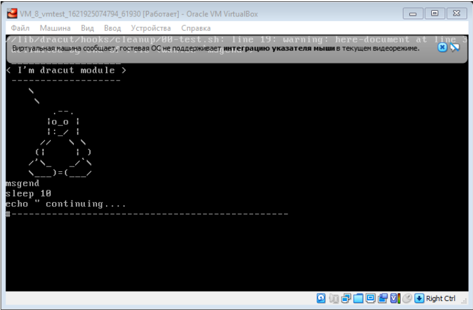

## Задание. 
1. Попасть в систему без пароля несколькими способами
2. Установить систему с LVM, после чего переименовать VG
3. Добавить модуль в initrd

## 1. Попасть в систему без пароля несколькими способами.

Способы входа в ОС приведены в файле "pdf\Вход без пароля.pdf"

## 2. Установить систему с LVM, после чего переименовать VG

Для развертывания системы был взял vagranfile из ДЗ 3 (CentOS/7 version = "1804.02").

Все действия записаны утилитой script.

Просмотреть можно:

	scriptreplay --timing file-otusboot.tm --typescript script-otusboot.out

Файлы в папке script: file-otusboot.tm и script-otusboot.out.

Ниже приведено описание основных действий.

###	2.1. Проверяем состояние и название Volume Group (VG).
[root@localhost ~]# vgs
  VG         #PV #LV #SN Attr   VSize   VFree
  VolGroup00   1   2   0 wz--n- <38.97g    0
  
 ###  2.2. Переименовываем VG c VolGroup00 в OtusRoot.
	[root@localhost ~]# vgrename VolGroup00 OtusRoot
	Volume group "VolGroup00" successfully renamed to "OtusRoot"
	[root@localhost ~]
	
### 2.3. Редактируем файлы /etc/fstab, /etc/default/grub и /boot/grub2/grub.cfg в части изменения VG

Ниже приведены файлы с измененной VG

	[root@localhost ~]# less /etc/fstab
	
	/dev/mapper/OtusRoot-LogVol00 /                       xfs     defaults        0 0
	UUID=570897ca-e759-4c81-90cf-389da6eee4cc /boot                   xfs     defaults        0 0
	/dev/mapper/OtusRoot-LogVol01 swap                    swap    defaults        0 0

	[root@localhost ~]# less /etc/default/grub
	GRUB_TIMEOUT=1
	GRUB_DISTRIBUTOR="$(sed 's, release .*$,,g' /etc/system-release)"
	GRUB_DEFAULT=saved
	GRUB_DISABLE_SUBMENU=true
	GRUB_TERMINAL_OUTPUT="console"
	GRUB_CMDLINE_LINUX="no_timer_check console=tty0 console=ttyS0,115200n8 net.ifnames=0 biosdevname=0 elevator=noop crashkernel=auto rd.lvm.lv=OtusRoot/LogVol00 rd.lvm.lv=OtusRoot/LogVol01 rhgb quiet"
	GRUB_DISABLE_RECOVERY="true"
	
Ниже приведен фрагмент файла grub.cfg где есть VG.
	[root@localhost ~]# less /boot/grub2/grub.cfg 
	linux16 /vmlinuz-3.10.0-862.2.3.el7.x86_64 root=/dev/mapper/OtusRoot-LogVol00 ro no_timer_check console=tty0 console=ttyS0,115200n8 net.ifnames=0 biosdevname=0 elevator=noop crashkernel=auto rd.lvm.lv=OtusRoot/LogVol00 rd.lvm.lv=OtusRoot/LogVol01 rhgb quiet
	initrd16 /initramfs-3.10.0-862.2.3.el7.x86_64.img

### 2.4. Пересоздаем initrd для применения нового значения VG
	mkinitrd -f -v /boot/initramfs-$(uname -r).img $(uname -r)

### 2.5. Перезагружаем ВМ и выполняем проверку, что изменение применено

	d:\Vagrant\VM-01>vagrant ssh
	[vagrant@localhost ~]$ sudo -i
	[root@localhost ~]# vgs
	  VG       #PV #LV #SN Attr   VSize   VFree
	  OtusRoot   1   2   0 wz--n- <38.97g    0
	[root@localhost ~]#
	
## 3. Добавить модуль в initrd

Все действия записаны утилитой script.

Просмотреть можно:

	scriptreplay --timing file-initdr.tm --typescript script-initdr.out

Файлы размещены в папке script: file-initdr.tm и script-initdr.out.

Ниже приведено описание основных действий.

### 3.1. Создаем каталог 01test

	[root@localhost ~] mkdir /usr/lib/dracut/modules.d/01test

### 3.2. Переходим в каталог 01test и создаем 2 файла - module-setup.sh и test.sh
	[root@localhost ~] vi module-setup.sh
	#!/bin/bash

	check() {
		return 0
	}

	depends() {
		return 0
	}

	install() {
		inst_hook cleanup 00 "${moddir}/test.sh"
	}

	[root@localhost ~] vi test.sh
		#!/bin/bash

	exec 0<>/dev/console 1<>/dev/console 2<>/dev/console
	cat <<'msgend'

	Hello! You are in dracut module!

	 ___________________
	< I'm dracut module >
	 -------------------
	   \
		\
			.--.
		   |o_o |
		   |:_/ |
		  //   \ \
		 (|     | )
		/'\_   _/`\
		\___)=(___/
	msgend
	sleep 10
	echo " continuing...."
	
### 3.3. Предосталяем право на выполнение созданным файлам.

	[root@localhost ~] chmod +x module-setup.sh
	[root@localhost ~] chmod +x test.sh

### 3.4. Пересоздаем образ initrd

	[root@localhost ~]mkinitrd -f -v /boot/initramfs-$(uname -r).img $(uname -r)
	
### 3.5. Проверяем наличие модуля test в созданном образе.

	[root@vmtest 01test]# lsinitrd -m /boot/initramfs-$(uname -r).img | grep test
	test

### 3.6. Перегружаем ВМ и перед загрузкой удаляем rghb и quiet

При загрузке выводится картинка:

 

