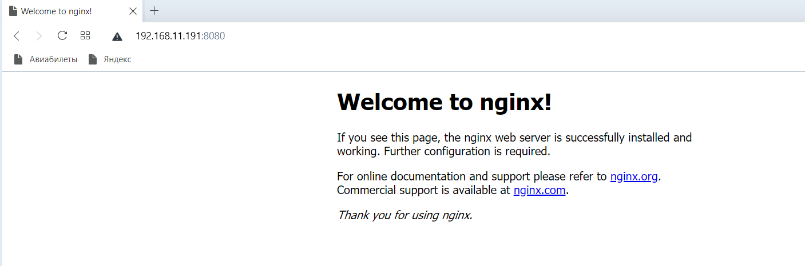

## ДЗ к Занятию 14

Подготовить стенд на Vagrant как минимум с одним сервером. На этом сервере используя Ansible необходимо развернуть nginx со следующими условиями:

	1. необходимо использовать модуль yum/apt;
	2. конфигурационные файлы должны быть взяты из шаблона jinja2 с перемененными;
	3. после установки nginx должен быть в режиме enabled в systemd;
	4. должен быть использован notify для старта nginx после установки;
	5. сайт должен слушать на нестандартном порту - 8080, для этого использовать переменные в Ansible.
	
## Выполнение ДЗ

### Роль ansible для развертывания nginx.
	
	Написана роль которая выпоняет:
		1. настройку репозитория nginx
		2. установку nginx c настроенного репозитория
		3. Конфигурирование nginx через созданный template 
		4. Конфигурирование сайта на работу через нестандартный порт 8080 через template
		5. Для запуска (перезапуска) и перевода в enabled написан headler файл

### Разработка Vagrantfile.
 
 Данный файл включает в себя несколько блоков:
  
  Блок 1 - Создание VM с CentOS 8, установка крайней версии ядра, создание драйверов VirtualBox и монтирование папки /vagrant
  
  Блок 2 - Выполнение script1.sh. Данный скрипт включает vagrant в группу wheel и предоставляет право авторизации пользователей по ssh с помощью пароля.
  
  Блок 3 - Выпонение script2.sh Данный скрипт создает ssh key для vagrant и выполняет его настройку.
  
  Блок 4 -  установка Ansible в созданной VM
  
  Блок 5 - выполнение Ansible роли развертывания и настройки nginx
  
  
### Развертывание VM c nginx

1. Создаем каталог на ПК и скачиваем в него файлы и каталоги. Каталог pic можно не скачивать.
2. переходим в каталог со скаченными файлами и каталогами
3. Выполняем команду: vagrant up
4. Ждем некоторое время. После завершения выполнения. Ниже крайние строки: 

		PLAY [nginx] *******************************************************************

		TASK [Gathering Facts] *********************************************************
		ok: [nginx1]

		TASK [nginx-centos : ensure wget installed] ************************************
		changed: [nginx1]

		TASK [nginx-centos : configure repo nginx] *************************************
		changed: [nginx1]

		TASK [nginx-centos : Install Nginx] ********************************************
		changed: [nginx1]

		TASK [nginx-centos : configure main nginx config] ******************************
		changed: [nginx1]

		TASK [nginx-centos : install new port] *****************************************
		changed: [nginx1]

		RUNNING HANDLER [nginx-centos : start nginx] ***********************************
		changed: [nginx1]

		RUNNING HANDLER [nginx-centos : reload nginx] **********************************
		changed: [nginx1]

		PLAY RECAP *********************************************************************
		nginx1                     : ok=8    changed=7    unreachable=0    failed=0    skipped=0    rescued=0    ignored=0

		==> vmtest: Running provisioner: shell...
			vmtest: Running: inline script
			vmtest: Last metadata expiration check: 0:00:09 ago on Mon 28 Jun 2021 02:53:28 PM UTC.
			vmtest: Package epel-release-8-11.el8.noarch is already installed.
			vmtest: Dependencies resolved.
			vmtest: Nothing to do.
			vmtest: Complete!
			vmtest: Last metadata expiration check: 0:00:10 ago on Mon 28 Jun 2021 02:53:28 PM UTC.
			vmtest: Package python36-3.6.8-2.module_el8.4.0+790+083e3d81.x86_64 is already installed.
			vmtest: Dependencies resolved.
			vmtest: Nothing to do.
			vmtest: Complete!
			vmtest: Last metadata expiration check: 0:00:11 ago on Mon 28 Jun 2021 02:53:28 PM UTC.
			vmtest: Package ansible-2.9.23-1.el8.noarch is already installed.
			vmtest: Dependencies resolved.
			vmtest: Nothing to do.
			vmtest: Complete!

5. Проверяем доступность nginx c ПК - http://192.168.11.191:8080
	
Результат:

