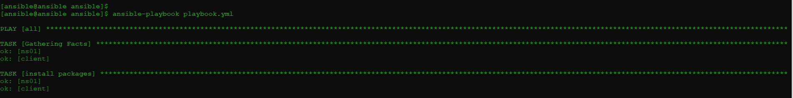
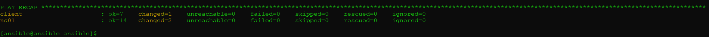
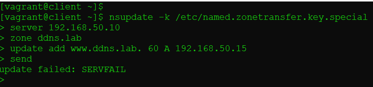
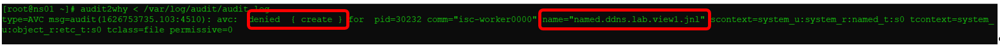
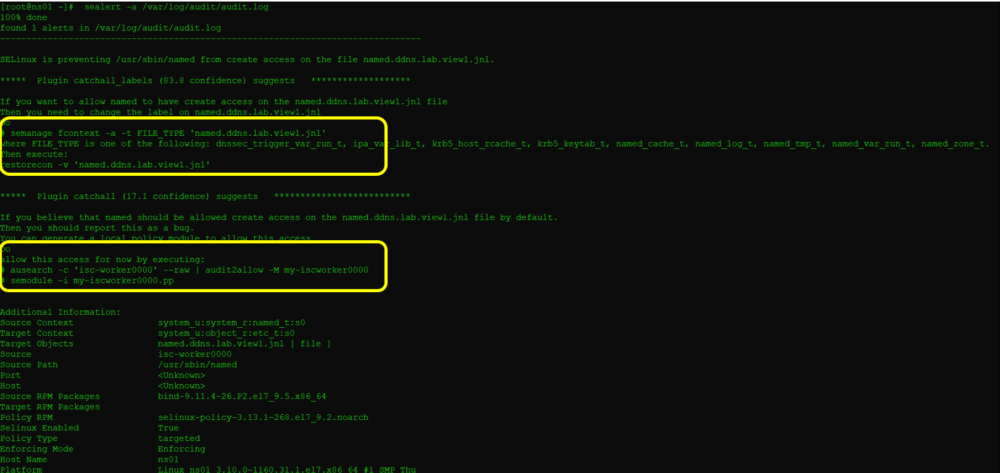
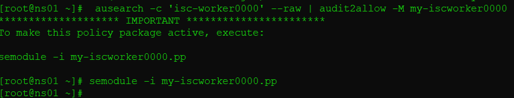

## ДЗ к Занятию 17

SE Linux - когда все запрещено.

Тренируем умение работать с SELinux: диагностировать проблемы и модифицировать политики SELinux для корректной работы приложений, если это требуется.

1.Запустить nginx на нестандартном порту 3-мя разными способами:

	переключатели setsebool;
	
	добавление нестандартного порта в имеющийся тип;
	
	формирование и установка модуля SELinux. 
	
 
	
## Решение задания 1

Для выполнения задания 1 подготовлен vagrantfile для создания ВМ c nginx c конфигурационным файлом для запуска по нестандартному порту.

Для работы с SE Linux устанавливаются необходимые пакеты.

### 1.1. После создания ВМ из vagrantfile входим по ssh и проверяем настройки:

		[root@vmtest ~]# systemctl status nginx.service
		● nginx.service - The nginx HTTP and reverse proxy server
		   Loaded: loaded (/usr/lib/systemd/system/nginx.service; enabled; vendor preset: disabled)
		   Active: inactive (dead)

		Jul 15 09:48:18 vmtest systemd[1]: nginx.service: Unit cannot be reloaded because it is inactive.
		[root@vmtest ~]# getenforce
		Enforcing
		[root@vmtest ~]#
		
### 1.2. Пытаемся запустить nginx и получаем сообщение об ошибке.

		[root@vmtest ~]# systemctl start nginx
		Job for nginx.service failed because the control process exited with error code.
		See "systemctl status nginx.service" and "journalctl -xe" for details.
		
### 1.3. Выполняем первичный анализ причин не старта nginx

	[root@vmtest ~]# systemctl status nginx
	● nginx.service - The nginx HTTP and reverse proxy server
	   Loaded: loaded (/usr/lib/systemd/system/nginx.service; enabled; vendor preset: disabled)
	   Active: failed (Result: exit-code) since Thu 2021-07-15 09:57:28 UTC; 1min 18s ago
	  Process: 18381 ExecStartPre=/usr/sbin/nginx -t (code=exited, status=1/FAILURE)
	  Process: 18380 ExecStartPre=/usr/bin/rm -f /run/nginx.pid (code=exited, status=0/SUCCESS)

	Jul 15 09:57:28 vmtest systemd[1]: Starting The nginx HTTP and reverse proxy server...
	Jul 15 09:57:28 vmtest nginx[18381]: nginx: the configuration file /etc/nginx/nginx.conf syntax is ok
	Jul 15 09:57:28 vmtest nginx[18381]: nginx: [emerg] bind() to 0.0.0.0:6180 failed (13: Permission denied)
	Jul 15 09:57:28 vmtest nginx[18381]: nginx: configuration file /etc/nginx/nginx.conf test failed
	Jul 15 09:57:28 vmtest systemd[1]: nginx.service: Control process exited, code=exited status=1
	Jul 15 09:57:28 vmtest systemd[1]: nginx.service: Failed with result 'exit-code'.
	Jul 15 09:57:28 vmtest systemd[1]: Failed to start The nginx HTTP and reverse proxy server.
	
Похоже возникли проблемы с SE Linux (Permission denied)

	nginx: [emerg] bind() to 0.0.0.0:6180 failed (13: Permission denied)
	
### 1.4. Проверяем файл /var/log/audit/audit.log. Находим строку. Но не очень понятно что делать.

		type=AVC msg=audit(1626343048.497:1310): avc:  denied  { name_bind } for  pid=18381 comm="nginx" src=6180 scontext=system_u:system_r:httpd_t:s0 tcontext=system_u:object_r:unreserved_port_t:s0 tclass=tcp_socket permissive=0

### 1.5. Проверяем контекст безопасности предоставленный nginx

		[root@vmtest ~]# whereis nginx
		nginx: /usr/sbin/nginx /usr/lib64/nginx /etc/nginx /usr/share/nginx /usr/share/man/man8/nginx.8.gz /usr/share/man/man3/nginx.3pm.gz
		
		[root@vmtest ~]# ls -Z /usr/sbin/nginx
		system_u:object_r:httpd_exec_t:s0 /usr/sbin/nginx
		
		[root@vmtest ~]# semanage port -l | grep http_port_t
		http_port_t                    tcp      80, 81, 443, 488, 8008, 8009, 8443, 9000
		pegasus_http_port_t            tcp      5988

	Видим что nginx разрешено использовать следующие порты - 80, 81, 443, 488, 8008, 8009, 8443, 9000

### 1.6. Для понимания дальнейших действий используем утилиты для работы с SELinux.
	
1.6.1. [root@vmtest ~]# audit2why < /var/log/audit/audit.log
	
	Результат вывода:
	
		type=AVC msg=audit(1626343048.497:1310): avc:  denied  { name_bind } for  pid=18381 comm="nginx" src=6180 scontext=system_u:system_r:httpd_t:s0 tcontext=system_u:object_r:unreserved_port_t:s0 tclass=tcp_socket permissive=0

				Was caused by:
				The boolean nis_enabled was set incorrectly.
				Description:
				Allow nis to enabled

				Allow access by executing:
				# setsebool -P nis_enabled 1	
				
Для предоставления доступа предлагается выполнить команду: setsebool -P nis_enabled 1
	
1.6.2. [root@vmtest ~]# sealert -a /var/log/audit/audit.log
	
Результат выполнения данной утилиты - вывод 3 рекомендации по устранению проблемы 
		

	
	
### 1.7. Устрание проблемы предлагаемыми способами.

1.7.1. Реализация варианта 1 : -> semanage port -a -t http_port_t -p tcp 6180

Результат. nginx запустился на нестандартном порту 6180

Возращаем полиики и праввила SE Linux в исходное состояние: semanage port -d -t http_port_t -p tcp 6180
		

		
		
1.7.2. Реализация варианта 2 : -> setsebool -P nis_enabled 1

Результат. nginx запустился на нестандартном порту 6180
		
Возращаем полиики и праввила SE Linux в исходное состояние:	setsebool -P nis_enabled 0
		

		
1.7.3. ausearch -c 'nginx' --raw | audit2allow -M my-nginx

semodule -i my-nginx.pp
		

## Решение задания 2

### 2.1. Развертывание стенда
Развертывание стенда выполнил как на хостовой машине с Windows, так и на хостовой машине с Astra Linux CE.
На хостовой машине с Astra Linux CE создание ВМ и выполнение playbook.yml прошло без проблем. При этом на данной хостовой машине должен быть установлен Ansible.
На хостовой машине с Windows потребовалось развернуть дополнительную ВМ. На ней установить Ansible, создать ssh key, пробросить из на развернуые c помощью vagrant ВМ (ns01 и client). После чего с ВМ Ansible запустить playbook.yml.
В обоих случаях после развертывания ВМ (ns01 и client) командой vagrant up необходимо было обновить kernel и установить kernel-devel для монтирования папки /vagrant
Результат выполнения playbook.yml ниведен ниже.

### 2.2. Выполнение команды обновления зоны
Результат выполнения команды.

По информации от системного администратора - проблема в SE Linux

### 2.3. Выполняем анализ файла /var/log/audit/audit.log c помощью утилиты audit2why. 

	audit2why < /var/log/audit/audit.log

Результат выполнения команды

В выводе видно, что отсутствует разрешение на создание файла с именем named.ddns.lab.view1.jnl

2.4. Выполнение анализа того же файла audit.log с помощью другой утилиты – sealert. 
Данная утилита помимо вывода причин возникновения ошибки, предлагает варианты решения возникшей проблемы.

	sealert –a /var/log/audit/audit.log

Результат выполнения команды.

Утилита для решения проблемы, предлагает 2 варианта:
Вариант 1: Изменить контекст безопасности параметра FILE_TYPE файла named.ddns.lab.view1.jnl.
1.1.	semanage fcontext -a -t FILE_TYPE 'named.ddns.lab.view1.jnl'
где -  FILE_TYPE is one of the following: dnssec_trigger_var_run_t, ipa_var_lib_t, krb5_host_rcache_t, krb5_keytab_t, named_cache_t, named_log_t, named_tmp_t, named_var_run_t, named_zone_t.
1.2.	recon -v 'named.ddns.lab.view1.jnl'
Вариант 2. – создать модуль разрешающий выполнять данное действие. 
2.1. ausearch -c 'isc-worker0000' --raw | audit2allow -M my-iscworker0000
2.2. semodule -i my-iscworker0000.pp
По моему мнению более предпочтительный вариант 1 он меняет контекст безопасности на конкретный файл. Но так файла еще нет (он не создам) данный вариант нене применим. Поэтому буду использовать вариант 2.

