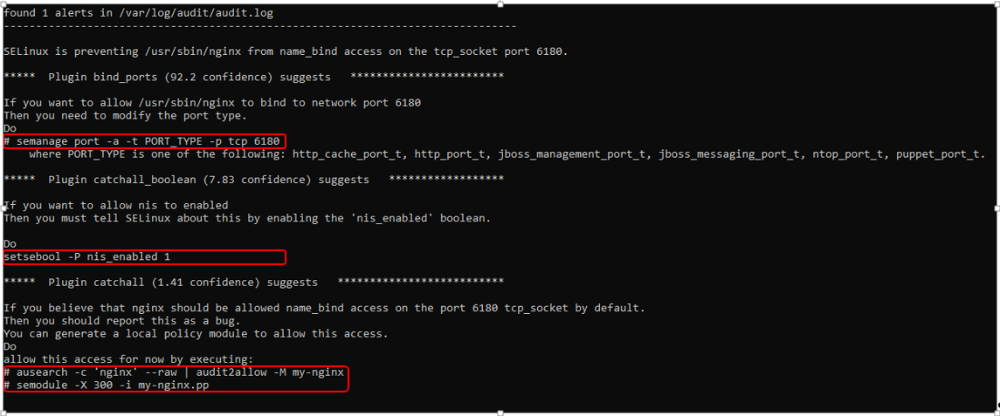
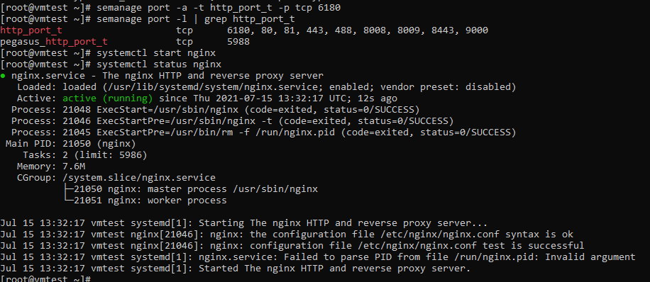
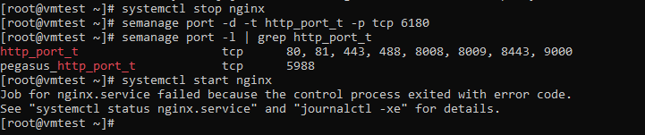
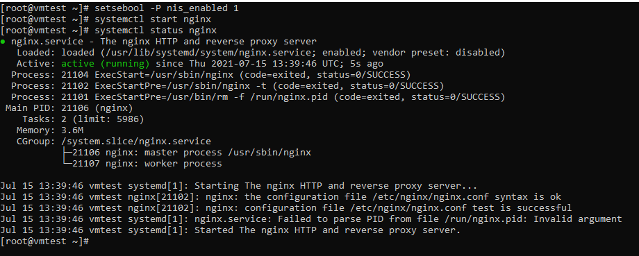
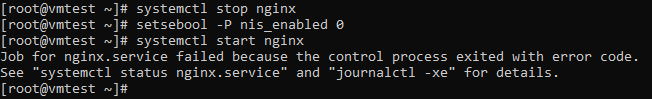
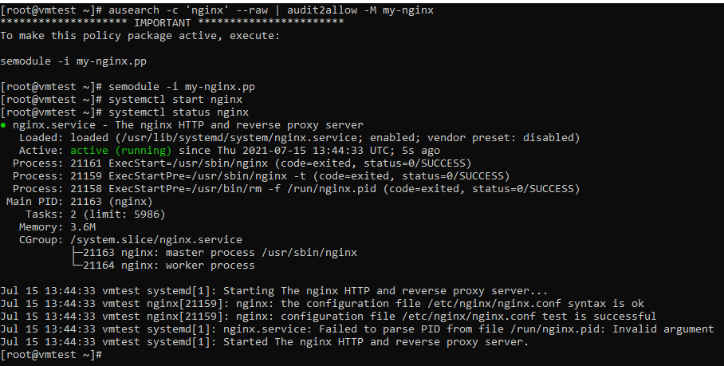

## ДЗ к Занятию 17

SE Linux - когда все запрещено.

Тренируем умение работать с SELinux: диагностировать проблемы и модифицировать политики SELinux для корректной работы приложений, если это требуется.

1.Запустить nginx на нестандартном порту 3-мя разными способами:

	переключатели setsebool;
	
	добавление нестандартного порта в имеющийся тип;
	
	формирование и установка модуля SELinux. 
	
 
	
## Решение задания 1

Для выполнения задания 1 подготовлен vagrantfile для создания ВМ c nginx c конфигурационным файлом для запуска по нестандартному порту.

Для работы с SE Linux устанавливаются необходимые пакеты.

### 1. После создания ВМ из vagrantfile входим по ssh и проверяем настройки:

		[root@vmtest ~]# systemctl status nginx.service
		● nginx.service - The nginx HTTP and reverse proxy server
		   Loaded: loaded (/usr/lib/systemd/system/nginx.service; enabled; vendor preset: disabled)
		   Active: inactive (dead)

		Jul 15 09:48:18 vmtest systemd[1]: nginx.service: Unit cannot be reloaded because it is inactive.
		[root@vmtest ~]# getenforce
		Enforcing
		[root@vmtest ~]#
		
### 2. Пытаемся запустить nginx и получаем сообщение об ошибке.

		[root@vmtest ~]# systemctl start nginx
		Job for nginx.service failed because the control process exited with error code.
		See "systemctl status nginx.service" and "journalctl -xe" for details.
		
### 3. Выполняем первичный анализ причин не старта nginx

	[root@vmtest ~]# systemctl status nginx
	● nginx.service - The nginx HTTP and reverse proxy server
	   Loaded: loaded (/usr/lib/systemd/system/nginx.service; enabled; vendor preset: disabled)
	   Active: failed (Result: exit-code) since Thu 2021-07-15 09:57:28 UTC; 1min 18s ago
	  Process: 18381 ExecStartPre=/usr/sbin/nginx -t (code=exited, status=1/FAILURE)
	  Process: 18380 ExecStartPre=/usr/bin/rm -f /run/nginx.pid (code=exited, status=0/SUCCESS)

	Jul 15 09:57:28 vmtest systemd[1]: Starting The nginx HTTP and reverse proxy server...
	Jul 15 09:57:28 vmtest nginx[18381]: nginx: the configuration file /etc/nginx/nginx.conf syntax is ok
	Jul 15 09:57:28 vmtest nginx[18381]: nginx: [emerg] bind() to 0.0.0.0:6180 failed (13: Permission denied)
	Jul 15 09:57:28 vmtest nginx[18381]: nginx: configuration file /etc/nginx/nginx.conf test failed
	Jul 15 09:57:28 vmtest systemd[1]: nginx.service: Control process exited, code=exited status=1
	Jul 15 09:57:28 vmtest systemd[1]: nginx.service: Failed with result 'exit-code'.
	Jul 15 09:57:28 vmtest systemd[1]: Failed to start The nginx HTTP and reverse proxy server.
	
Похоже возникли проблемы с SE Linux (Permission denied)

	nginx: [emerg] bind() to 0.0.0.0:6180 failed (13: Permission denied)
	
### 4. Проверяем файл /var/log/audit/audit.log. Находим строку. Но не очень понятно что делать.

		type=AVC msg=audit(1626343048.497:1310): avc:  denied  { name_bind } for  pid=18381 comm="nginx" src=6180 scontext=system_u:system_r:httpd_t:s0 tcontext=system_u:object_r:unreserved_port_t:s0 tclass=tcp_socket permissive=0

### 5. Проверяем контекст безопасности предоставленный nginx

		[root@vmtest ~]# whereis nginx
		nginx: /usr/sbin/nginx /usr/lib64/nginx /etc/nginx /usr/share/nginx /usr/share/man/man8/nginx.8.gz /usr/share/man/man3/nginx.3pm.gz
		
		[root@vmtest ~]# ls -Z /usr/sbin/nginx
		system_u:object_r:httpd_exec_t:s0 /usr/sbin/nginx
		
		[root@vmtest ~]# semanage port -l | grep http_port_t
		http_port_t                    tcp      80, 81, 443, 488, 8008, 8009, 8443, 9000
		pegasus_http_port_t            tcp      5988

	Видим что nginx разрешено использовать следующие порты - 80, 81, 443, 488, 8008, 8009, 8443, 9000

### 6. Для понимания дальнейших действий используем утилиты для работы с SELinux.
	
6.1. [root@vmtest ~]# audit2why < /var/log/audit/audit.log
	
	Результат вывода:
	
		type=AVC msg=audit(1626343048.497:1310): avc:  denied  { name_bind } for  pid=18381 comm="nginx" src=6180 scontext=system_u:system_r:httpd_t:s0 tcontext=system_u:object_r:unreserved_port_t:s0 tclass=tcp_socket permissive=0

				Was caused by:
				The boolean nis_enabled was set incorrectly.
				Description:
				Allow nis to enabled

				Allow access by executing:
				# setsebool -P nis_enabled 1	
				
Для предоставления доступа предлагается выполнить команду: setsebool -P nis_enabled 1
	
6.2. [root@vmtest ~]# sealert -a /var/log/audit/audit.log
	
Результат выполнения данной утилиты - вывод 3 рекомендации по устранению проблемы 
		

	
	
7. Устрание проблемы предлагаемыми способами.

7.1. Реализация варианта 1 : -> semanage port -a -t http_port_t -p tcp 6180

Результат. nginx запустился на нестандартном порту 6180

Возращаем полиики и праввила SE Linux в исходное состояние: semanage port -d -t http_port_t -p tcp 6180
		

		
		
7.2. Реализация варианта 2 : -> setsebool -P nis_enabled 1

Результат. nginx запустился на нестандартном порту 6180
		
Возращаем полиики и праввила SE Linux в исходное состояние:	setsebool -P nis_enabled 0
		

		
7.3. ausearch -c 'nginx' --raw | audit2allow -M my-nginx

semodule -i my-nginx.pp
		

		
		
