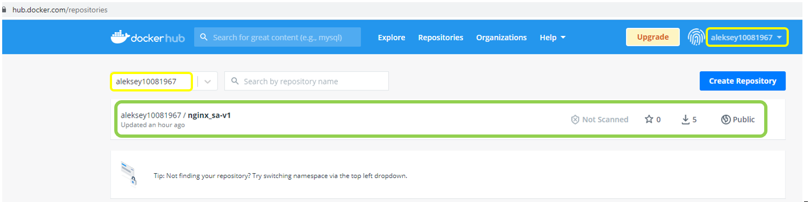
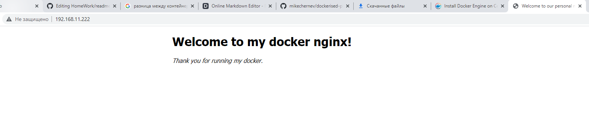
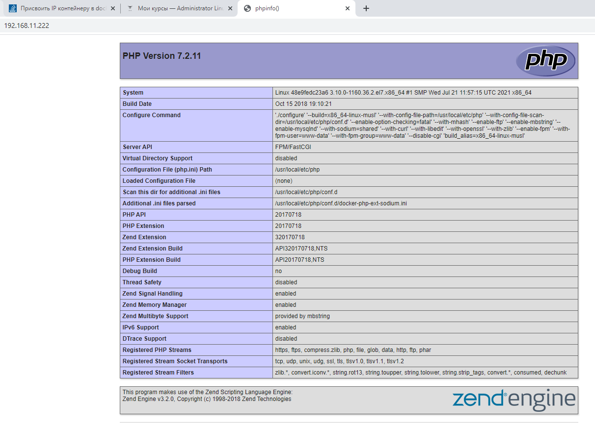
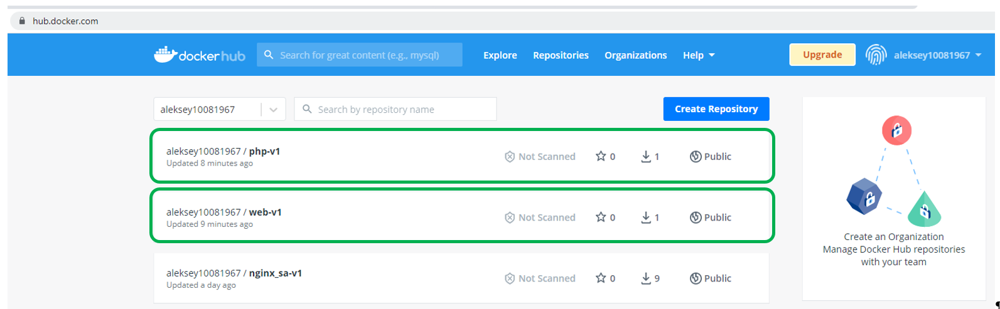

## ДЗ к Занятию

Docker

### Задание 1

Создайте свой кастомный образ nginx на базе alpine. После запуска nginx должен отдавать кастомную страницу (достаточно изменить дефолтную страницу nginx)

Определите разницу между контейнером и образом. Вывод опишите в домашнем задании.

Ответьте на вопрос: Можно ли в контейнере собрать ядро?

Собранный образ необходимо запушить в docker hub и дать ссылку на ваш репозиторий.

### Задание 2

Создайте кастомные образы nginx и php, 

объедините их в docker-compose.

После запуска nginx должен показывать php info.Все собранные образы должны быть в docker hub

## Решение задания 1

### 1.1. Устанавливаем docker

	yum install -y yum-utils
	yum-config-manager --add-repo https://download.docker.com/linux/centos/docker-ce.repo
	yum install -y  docker-ce docker-ce-cli containerd.io
	systemctl start docker.service
	systemctl enable docker.service

### 1.2. Для сборки image создаем следующие файлы.
		
    [root@vmtest docker]# ls -al
		-rwxrwxrwx. 1 vagrant vagrant  345 Jul 13 11:08 default.conf
		-rwxrwxrwx. 1 vagrant vagrant  225 Jul 23 05:02 Dockerfile
		-rwxrwxrwx. 1 vagrant vagrant  341 Jul 13 11:08 index.html

### 1.2.1. Содержание файла Dockerfile

		FROM alpine:3.7
		RUN apk update \
		&& apk upgrade \
		&& apk add nginx\
		&& mkdir -p /run/nginx
		COPY ./default.conf /etc/nginx/conf.d/
		COPY ./index.html /usr/share/nginx/html/
		EXPOSE 80
		CMD ["nginx", "-g", "daemon off;"]

### 1.2.2. Содержание файла default.conf
		
      listen       80;
			server_name  localhost;
			location / {
				root   /usr/share/nginx/html;
				index  index.html index.htm;
			}
			error_page   500 502 503 504  /50x.html;
			location = /50x.html {
				root   /usr/share/nginx/html;
			}
		}

### 1.2.3. Содержание файла index.html (Измененная первая страница nginx)

    <!DOCTYPE html>
		<html>
		<head>
		<title>Welcome to our personal nginx start page!</title>
		
		</head>
		<body>
		<h1>Welcome to my docker nginx!</h1>

		
<em>Thank you for running my docker.</em>

		</body>
		</html>

### 1.3. Собираем образ на основе файла Dockerfile.

		[root@vmtest docker]# docker build -f Dockerfile -t nginx_sa:alpine .

		Sending build context to Docker daemon  4.096kB
		Step 1/6 : FROM alpine:3.7
		 ---> 6d1ef012b567
		Step 2/6 : RUN apk update && apk upgrade && apk add nginx&& mkdir -p /run/nginx
		 ---> Running in d7dafbf94309
		fetch http://dl-cdn.alpinelinux.org/alpine/v3.7/main/x86_64/APKINDEX.tar.gz
		fetch http://dl-cdn.alpinelinux.org/alpine/v3.7/community/x86_64/APKINDEX.tar.gz
		v3.7.3-184-gffd32bfd09 [http://dl-cdn.alpinelinux.org/alpine/v3.7/main]
		v3.7.3-194-gcddd1b2302 [http://dl-cdn.alpinelinux.org/alpine/v3.7/community]
		OK: 9054 distinct packages available
		(1/2) Upgrading musl (1.1.18-r3 -> 1.1.18-r4)
		(2/2) Upgrading musl-utils (1.1.18-r3 -> 1.1.18-r4)
		Executing busybox-1.27.2-r11.trigger
		OK: 4 MiB in 13 packages
		(1/2) Installing pcre (8.41-r1)
		(2/2) Installing nginx (1.12.2-r4)
		Executing nginx-1.12.2-r4.pre-install
		Executing busybox-1.27.2-r11.trigger
		OK: 6 MiB in 15 packages
		Removing intermediate container d7dafbf94309
		 ---> 568d36eee844
		Step 3/6 : COPY ./default.conf /etc/nginx/conf.d/
		 ---> 6a1508ca40b8
		Step 4/6 : COPY ./index.html /usr/share/nginx/html/
		 ---> 174fde365160
		Step 5/6 : EXPOSE 80
		 ---> Running in 402bcf72763c
		Removing intermediate container 402bcf72763c
		 ---> 9a62e79444ed
		Step 6/6 : CMD ["nginx", "-g", "daemon off;"]
		 ---> Running in dc071ce0474a
		Removing intermediate container dc071ce0474a
		 ---> 51060de7681e
		Successfully built 51060de7681e
		Successfully tagged nginx_sa:alpine

Cмотрим что получилось

		[root@vmtest docker]# docker images
		REPOSITORY   TAG       IMAGE ID       CREATED              SIZE
		nginx_sa     alpine    51060de7681e   About a minute ago   7.46MB
		alpine       3.7       6d1ef012b567   2 years ago          4.21MB

### 1.4. Запускаем докер с пробросом 80 порта хостовой ВМ на 80 порт докера.

		[root@vmtest docker]# docker run -d -p 80:80 nginx_sa:alpine
		959a54236a08020a84ff08709df2ab37eec4d6b6c73bf4a00cb1a5ab08a11c0a

		[root@vmtest docker]# docker ps
		CONTAINER ID   IMAGE             COMMAND                  CREATED         STATUS         PORTS                               NAMES
		959a54236a08   nginx_sa:alpine   "nginx -g 'daemon of…"   7 minutes ago   Up 7 minutes   0.0.0.0:80->80/tcp, :::80->80/tcp   hardcore_lovelace

Проверяем работу nginx через браузер хостовой машины подключившись по http к ВМ где запущен контейнер.

### 1.5. Размещение образа докера на DockerHub:

1.5.1. Регистрируемся на Docker Hub - aleksey10081967

1.5.2. Из терминала выполняем команду - docker login

1.5.3. После успешной авторизации указывваем образ, который хотим залить на dockerhub и его имя на портале

			docker tag nginx_sa:alpine aleksey10081967/nginx_sa-v1:alpine

***Для информации:***

***В имени образа который будет выложен на портале первым должен быть указан login созданный на портале -> aleksey10081967/nginx_sa-v1:alpine***

***Иначе при размещении на портал получаем ошибку: denied: requested access to the resource is denied***

1.5.4. Загружаем образ на dockerhub

			docker push aleksey10081967/nginx_sa-v1:alpine
			
Имеем загруженный на DockerHub собранный образ nginx ввиде поекта.

Ссылка: https://hub.docker.com/repository/docker/aleksey10081967/nginx_sa-v1:alpine

### 1.6. Выполняем проверку загруженного образа на портал 

	1.6.1 Скачиваем образ с dockerhub
	
		docker pull aleksey10081967/nginx_sa-v1:alpine
		docker images -a
			
	1.6.2 Запускаем контейнер
	
		docker run -d -p 80:80 aleksey10081967/nginx_sa-v1:alpine
 
 Проверяем работу nginx через браузер хостовой машины подключившись по http к ВМ где запущен контейнер.
 
 

## Определите разницу между контейнером и образом. Вывод опишите в домашнем задании.

 Образ - это набор слоев,в которые в процессе создания записывается различная информация, в том числе и ПО. Данная информация статическая и ее изменение возможно при изменении  образа. А это уже новый образ.
 
Контейнер - это экземпляр образа, динамическое состояние образа. В процессе жизни контейнера в нем могут добавляться,изменяться,удалятся объекты (файлы, каталоги, ПО и т.д.), размещенные в контейнере. При уничтожении контейнера вся измененния внесенные в объекты контейнера будут потеряны. 

При повторном создании контейнера объекты будут в состояни которое сохранено в образе.

## Можно ли в контейнере собрать ядро?
Да, наверное можно. Но для запуска ядра нужно дополнительно во внутрь контейнера засунуть ПО для виртуализации. Данное ПО сможет загрузить собранное ядро.
 

## Решение Задания 2.

### 2.1. Создание каталог docker-compose c подкаталогами
Создаем в каталоге /vagrant указанный каталог со следующими подкаталогами.

	[root@vmtest docker_compose4]# pwd
	/vagrant/docker_compose4

	[root@vmtest docker_compose4]# ls -al
	total 12
	drwxrwxrwx. 1 vagrant vagrant 4096 Jul 29 12:18 .
	drwxrwxrwx. 1 vagrant vagrant 4096 Jul 29 12:17 ..
	-rwxrwxrwx. 1 vagrant vagrant  585 Jul 29 12:06 docker-compose.yml
	drwxrwxrwx. 1 vagrant vagrant    0 Jul 29 12:18 file_conf
	drwxrwxrwx. 1 vagrant vagrant    0 Jul 29 12:18 nginx
	drwxrwxrwx. 1 vagrant vagrant    0 Jul 29 12:18 php7

В каталоге docker-compose размещаем файл docker-compose.yml.

Содержание файла:

	version: '3'
	services:
	  web:
	    build:
	      context: ./nginx
	    container_name: web
	    depends_on:
	      - php
	    volumes:
	      - ./file_conf/:/code
	      - ./nginx/:/etc/nginx/conf.d
	    ports:
	      - "80:80"
	    networks:
	      front_net:
		ipv4_address: 10.20.30.10

	  php:
	    build:
	      context: ./php7
	    volumes:
	      - ./file_conf/:/code
	    ports:
	      - "9000:9000"
	    networks:
	      front_net:
		ipv4_address: 10.20.30.20

	networks:
	  front_net:
	      ipam:
		config:
		  - subnet: "10.20.30.0/24"

В подкаталоге file_conf размещаем файл index.php.

Содержание файла:

	<?php
	phpinfo();

В подкаталоге nginx размещаем файлы - default.conf (конфигурационный файл nginx) и dockerfile (файл для сборки контейнера nginx)

Содержание файла default.conf:

	server {
	 listen 80;
	    index index.php index.html;
	    server_name localhost;
	    error_log  /var/log/nginx/error.log;
	    access_log /var/log/nginx/access.log;
	    root /code;

	    location ~ ^/.+\.php(/|$) {
		fastcgi_pass php:9000;
		fastcgi_split_path_info ^(.+\.php)(/.*)$;
		include fastcgi_params;
		fastcgi_param SCRIPT_FILENAME $document_root$fastcgi_script_name;
		fastcgi_param HTTPS off;
	    }
	}

Содержание файла dockerfile:

	FROM alpine:3.7

	RUN apk update \
	&& apk upgrade \
	&& apk add nginx\
	&& mkdir -p /run/nginx

	EXPOSE 80

	CMD ["nginx", "-g", "daemon off;"]

В подкаталоге php7 размещаем файл - dockerfile (файл для сборки контейнера php)

	FROM php:7.2-fpm-alpine3.7

### 2.2. Проверка наличие локальных образом на ВМ.

	[root@vmtest docker_compose4]# docker images
	REPOSITORY   TAG       IMAGE ID   CREATED   SIZE
	[root@vmtest docker_compose]# docker system df
	TYPE            TOTAL     ACTIVE    SIZE      RECLAIMABLE
	Images          0         0         0B        0B
	Containers      0         0         0B        0B
	Local Volumes   0         0         0B        0B
	Build Cache     0         0         0B        0B
	[root@vmtest docker_compose]#

На ВМ ничего лишнего нет.

### 2.2. Выполнение сборки образов и запуск контейнеров через файл docker-compose.yml

[root@vmtest docker_compose4]# docker-compose up --build

	Building php
	Sending build context to Docker daemon  2.048kB
	Step 1/1 : FROM php:7.2-fpm-alpine3.7
	7.2-fpm-alpine3.7: Pulling from library/php
	c67f3896b22c: Pull complete
	88777455d910: Pull complete
	955e2028dd61: Pull complete
	7d47ce93cc1f: Pull complete
	591bb8d9afc3: Pull complete
	10a158dd6f4a: Pull complete
	4aa0e93a6621: Pull complete
	a5e3d48db581: Pull complete
	a53ed1f96150: Pull complete
	9b01b7a38d4e: Pull complete
	6100beaf6f07: Pull complete
	Digest: sha256:a990e5ff7b2e5a77ecfa904186d791fe6a0c52a267a607b6a578e6a48d9e1e29
	Status: Downloaded newer image for php:7.2-fpm-alpine3.7
	 ---> a2dfd79ee40c
	Successfully built a2dfd79ee40c
	Successfully tagged docker_compose_4_php:latest
	Building web
	Sending build context to Docker daemon  3.072kB
	Step 1/4 : FROM alpine:3.7
	3.7: Pulling from library/alpine
	5d20c808ce19: Pull complete
	Digest: sha256:8421d9a84432575381bfabd248f1eb56f3aa21d9d7cd2511583c68c9b7511d10
	Status: Downloaded newer image for alpine:3.7
	 ---> 6d1ef012b567
	Step 2/4 : RUN apk update && apk upgrade && apk add nginx&& mkdir -p /run/nginx
	 ---> Running in cbea3f92c26a
	fetch http://dl-cdn.alpinelinux.org/alpine/v3.7/main/x86_64/APKINDEX.tar.gz
	fetch http://dl-cdn.alpinelinux.org/alpine/v3.7/community/x86_64/APKINDEX.tar.gz
	v3.7.3-184-gffd32bfd09 [http://dl-cdn.alpinelinux.org/alpine/v3.7/main]
	v3.7.3-194-gcddd1b2302 [http://dl-cdn.alpinelinux.org/alpine/v3.7/community]
	OK: 9054 distinct packages available
	(1/2) Upgrading musl (1.1.18-r3 -> 1.1.18-r4)
	(2/2) Upgrading musl-utils (1.1.18-r3 -> 1.1.18-r4)
	Executing busybox-1.27.2-r11.trigger
	OK: 4 MiB in 13 packages
	(1/2) Installing pcre (8.41-r1)
	(2/2) Installing nginx (1.12.2-r4)
	Executing nginx-1.12.2-r4.pre-install
	Executing busybox-1.27.2-r11.trigger
	OK: 6 MiB in 15 packages
	Removing intermediate container cbea3f92c26a
	 ---> bb53afdca655
	Step 3/4 : EXPOSE 80
	 ---> Running in bc3cb237ad32
	Removing intermediate container bc3cb237ad32
	 ---> 629d544d4b2e
	Step 4/4 : CMD ["nginx", "-g", "daemon off;"]
	 ---> Running in 19974386c1b2
	Removing intermediate container 19974386c1b2
	 ---> d986ff9c0489
	Successfully built d986ff9c0489
	Successfully tagged docker_compose_4_web:latest
	Creating docker_compose_4_php_1 ... done
	Creating web                    ... done
	Attaching to docker_compose_4_php_1, web
	php_1  | [29-Jul-2021 13:05:30] NOTICE: fpm is running, pid 1
	php_1  | [29-Jul-2021 13:05:30] NOTICE: ready to handle connections
	php_1  | 10.20.30.10 -  29/Jul/2021:13:05:58 +0000 "GET /index.php" 200	

### 2.3. Проверяем вывод страницы php

 	
	
	
 ### 2.4. Размещение образов докера на DockerHub.	

Смотрим что у нас есть в локальном хранилище образов.

	[root@vmtest docker_compose_4]# docker images
	REPOSITORY             TAG                 IMAGE ID       CREATED              SIZE
	docker_compose_4_web   latest              08930daa54c2   About a minute ago   7.46MB
	alpine                 3.7                 6d1ef012b567   2 years ago          4.21MB
	docker_compose_4_php   latest              a2dfd79ee40c   2 years ago          77.6MB
	php                    7.2-fpm-alpine3.7   a2dfd79ee40c   2 years ago          77.6MB

Размещать на Docker hub будем - docker_compose_4_web:latest и docker_compose_4_php:latest. Для этого выполняем следующие дествия:
2.4.1 Поключаемся к Docker hub
	[root@vmtest docker_compose_4]# docker login
	Login with your Docker ID to push and pull images from Docker Hub. If you don't have a Docker ID, head over to https://hub.docker.com to create one.
	Username: aleksey10081967
	Password:
	WARNING! Your password will be stored unencrypted in /root/.docker/config.json.
	Configure a credential helper to remove this warning. See
	https://docs.docker.com/engine/reference/commandline/login/#credentials-store

	Login Succeeded
2.4.2 Создаем tag для передаваемых образом:

	[root@vmtest docker_compose_4]# docker tag docker_compose_4_web:latest aleksey10081967/web-v1:alpine
	[root@vmtest docker_compose_4]# docker tag docker_compose_4_php:latest aleksey10081967/php-v1:alpine
	
2.4.3 Размещаем образы на Docker Hub

	[root@vmtest docker_compose_4]# docker push aleksey10081967/web-v1:alpine
	The push refers to repository [docker.io/aleksey10081967/web-v1]
	f729049cad43: Pushed
	3fc64803ca2d: Mounted from aleksey10081967/nginx_sa-v1
	alpine: digest: sha256:cf67d72efb2e778088b4d893e5f979b759fb1c97e5b70983bccb3832da092fda size: 739

	[root@vmtest docker_compose_4]# docker push aleksey10081967/php-v1:alpine
	The push refers to repository [docker.io/aleksey10081967/php-v1]
	a219a6485189: Mounted from library/php
	9ff384c242d9: Mounted from library/php
	c2775d6cea45: Mounted from library/php
	c88b2983c3ba: Mounted from library/php
	f8dadb08abb9: Mounted from library/php
	bcbe08cb547c: Mounted from library/php
	94c73441b05f: Mounted from library/php
	dc00fbef458a: Mounted from library/php
	9922bc15eeef: Mounted from library/php
	0ea33a93585c: Mounted from library/php
	ebf12965380b: Mounted from library/php
	alpine: digest: sha256:27d6009fab648088b00c606629a8c254331e04b136def4d1a7e0b147213aacad size: 2618
	[root@vmtest docker_compose_4]#

2.4.4. Проверяем наличие образов на Docker hub.

### 2.5. Проверяем развертывание контейнеров с DockerHub.

2.5.1. Скачиваем образы с Docker Hub

	[root@vmtest docker_compose_4]# docker pull aleksey10081967/web-v1:alpine
	alpine: Pulling from aleksey10081967/web-v1
	5d20c808ce19: Pull complete
	83af4ca014ee: Pull complete
	Digest: sha256:cf67d72efb2e778088b4d893e5f979b759fb1c97e5b70983bccb3832da092fda
	Status: Downloaded newer image for aleksey10081967/web-v1:alpine
	docker.io/aleksey10081967/web-v1:alpine
	[root@vmtest docker_compose_4]# docker pull aleksey10081967/php-v1:alpine
	alpine: Pulling from aleksey10081967/php-v1
	c67f3896b22c: Pull complete
	88777455d910: Pull complete
	955e2028dd61: Pull complete
	7d47ce93cc1f: Pull complete
	591bb8d9afc3: Pull complete
	10a158dd6f4a: Pull complete
	4aa0e93a6621: Pull complete
	a5e3d48db581: Pull complete
	a53ed1f96150: Pull complete
	9b01b7a38d4e: Pull complete
	6100beaf6f07: Pull complete
	Digest: sha256:27d6009fab648088b00c606629a8c254331e04b136def4d1a7e0b147213aacad
	Status: Downloaded newer image for aleksey10081967/php-v1:alpine
	docker.io/aleksey10081967/php-v1:alpine

2.5.2 Проверяем наличие образов в локальном хранилище.

	[root@vmtest docker_compose_4]# docker images
	REPOSITORY               TAG       IMAGE ID       CREATED          SIZE
	aleksey10081967/web-v1   alpine    08930daa54c2   31 minutes ago   7.46MB
	aleksey10081967/php-v1   alpine    a2dfd79ee40c   2 years ago      77.6MB

2.5.2. Запускаем docker-compose c файлов который использует для развертывания контейнеров скаченные образы.

	[root@vmtest docker_compose_4]# docker-compose -f docker-compose-1.yml up
	Creating docker_compose_4_php_1 ... done
	Creating web                    ... done
	Attaching to docker_compose_4_php_1, web
	php_1  | [29-Jul-2021 14:23:27] NOTICE: fpm is running, pid 1
	php_1  | [29-Jul-2021 14:23:27] NOTICE: ready to handle connections

2.5.3. Проверяем загрузку страницы php.

