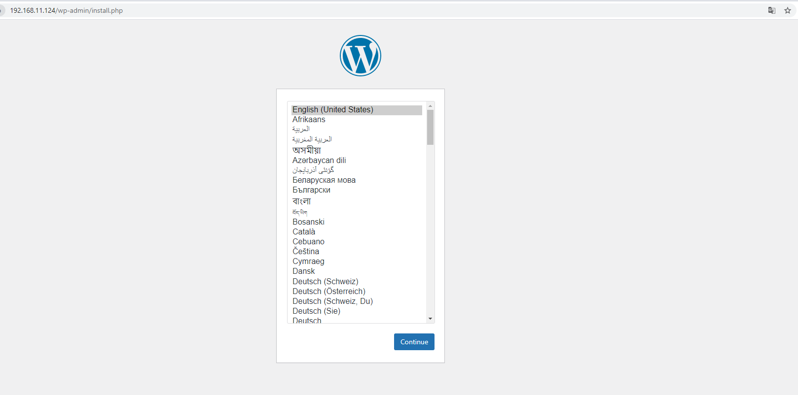
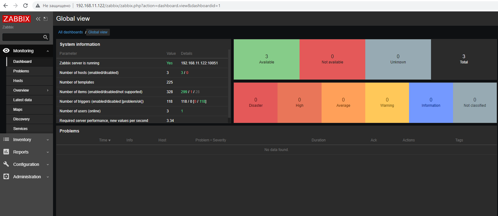
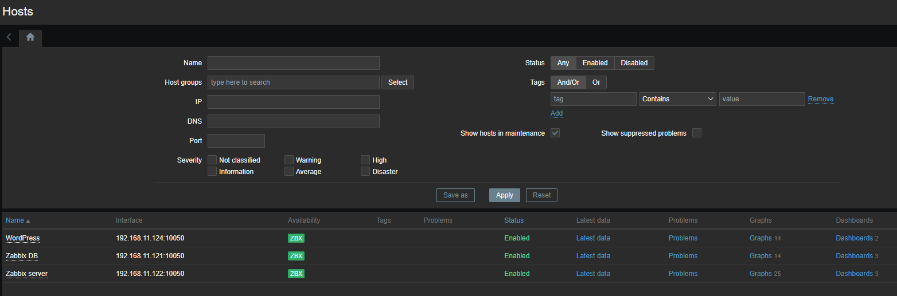
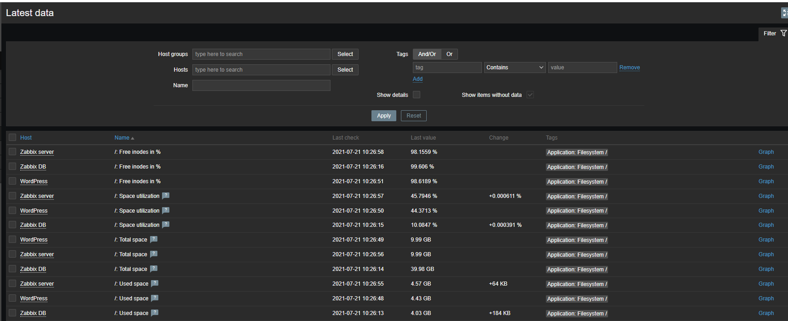
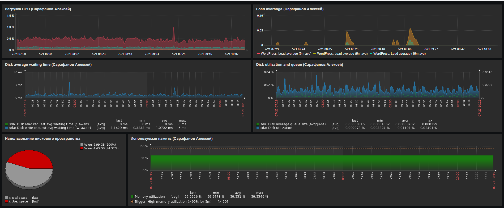
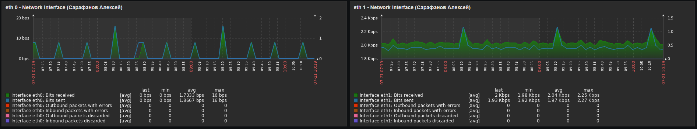
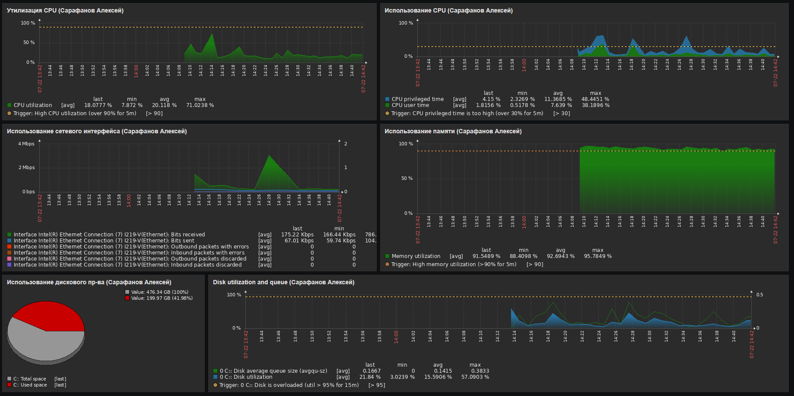

## ДЗ к Занятию 20
 
Prometheus, Zabbix 

### Задание 1

Настроить дашборд с 4-мя графиками: память, процессор, диск, сеть.

Настроить на одной из систем: zabbix (использовать screen (комплексный экран)), prometheus - grafana.

В качестве результата прислать скриншот экрана - дашборд должен содержать в названии имя приславшего.

### Решение задания 1

### 1. Развертывание стенда мониторинга Zabbix.
Стенд мониторинга включает в себя 3ВМ. 
 BM1 - СУБД Postgres c бд для работы Zabbix (IP - 192.168.11.121)
 ВМ2 - Apache+Zabbix (IP - 192.168.11.122)
 BM3 - WordPress как тестовый сервер. (IP - 192.168.11.124)
 
 Развертывание ВМ1 выполнялось с помощью vagrant. Файл vagrantfile размещен в папке vagrant_vm. 
 СУБД Postgres разворачивалась с помощью ansible playbook. Данный playbook запускался с отдельной ВМ настроенной для управления ansible. PlayBook размещен в папке ans_postgres. 
 
 Развертывание ВМ2 выполнялось с помощью vagrant. Файл vagrantfile размещен в папке vagrant_vm.
 Развертывание Zabbix+Apache и настройка БД Postgresql выполнялась руками.
 
 Развертывание ВМ3 выполнялось с помощью vagrant.  Файл vagrantfile размещен в папке vagrant_wordpress. После окончания развертывания для окончательной настройки необходимо подключиться по адресу: http://192.168.11.124/
 
 
  
 ### Последовательность действий по развертыванию Zabbix на ВМ2 и настройке БД Postgres на ВМ1.
 
 ### На ВМ2 (фронтэнд Zabbix):
 1. Установка репозитория zabbix
   
        dnf -y install https://repo.zabbix.com/zabbix/5.4/rhel/8/x86_64/zabbix-release-5.4-1.el8.noarch.rpm  
    
 2. Установка web ceрвера apache
 
	      dnf -y install httpd
	      
 3. Развертывание пакетов zabbix для apache:
 
	      dnf -y install zabbix-server-pgsql zabbix-web-pgsql zabbix-apache-conf zabbix-sql-scripts zabbix-agent

 4. Редактирование реквизитов файла zabbix_server.conf

        DBHost=192.168.11.121
        DBName=zabbix
        DBUser=zabbix
        DBPassword=zabbix

5. Копирование схемы DB на сервер БД (ВМ 1) в профиль postgres

       scp /usr/share/doc/zabbix-sql-scripts/postgresql/create.sql.gz postgres@192.168.11.121:/home/postgres
     
 6. Настраиваем работу сервисов
 
        systemctl start zabbix-server zabbix-agent httpd php-fpm
        systemctl enable zabbix-server zabbix-agent httpd php-fpm

7. Дополнительно настраиваем SE Linux

       setsebool -P httpd_can_connect_zabbix on
       setsebool -P httpd_can_network_connect_db on
       ausearch -c 'zabbix_server' --raw | audit2allow -M my-zabbixserver
       semodule -X 300 -i my-zabbixserver.pp
       
8. Настраиваем агента zabbix для мониторинга путем редактирования параметров файла /etc/

        PidFile=/var/run/zabbix/zabbix_agentd.pid
        LogFile=/var/log/zabbix/zabbix_agentd.log
        LogFileSize=0
        Server=192.168.11.121
        ServerActive=192.168.11.121
        Hostname=anstest2
        Include=/etc/zabbix/zabbix_agentd.d/*.conf
  
  Данный пуннкт выполняется на всех ВМ которые ставятся на мониторинг после установки агента zabbix
  

### На сервере БД (ВМ2) Выполняем следующие действия:
	
1. Делаем владельцев перенесенного файла postgres

       chown postgres:postgres create.sql.gz

2. Создаем пользователя zabbix в СУБД:
     
       sudo -u postgres createuser --pwprompt zabbix

3. Создаем базу данных zabbix 

   	sudo -u postgres createdb -O zabbix zabbix
	
 4. Создаем объекты БД из файла create.sql.gz. Выполняем команду ниже из под пользователя postgres
	
        zcat /usr/share/doc/zabbix-server-pgsql/create.sql.gz | psql -U zabbix -d zabbix
         
После выполнения настроек выполняем первый вход в zabbix: http://192.168.11.122/zabbix

### Подключение ВМ к Zabbix.
К системе мониторинга Zabbix были подключены 3 ВМ.

После подключения серверов к Zabbix пошел сбор данных

### Комплексный экран для мониторинга ВМ 3 (WordPress)

Дополнительно настроен мониторинг хостовой машины под управлением Windows.

 

