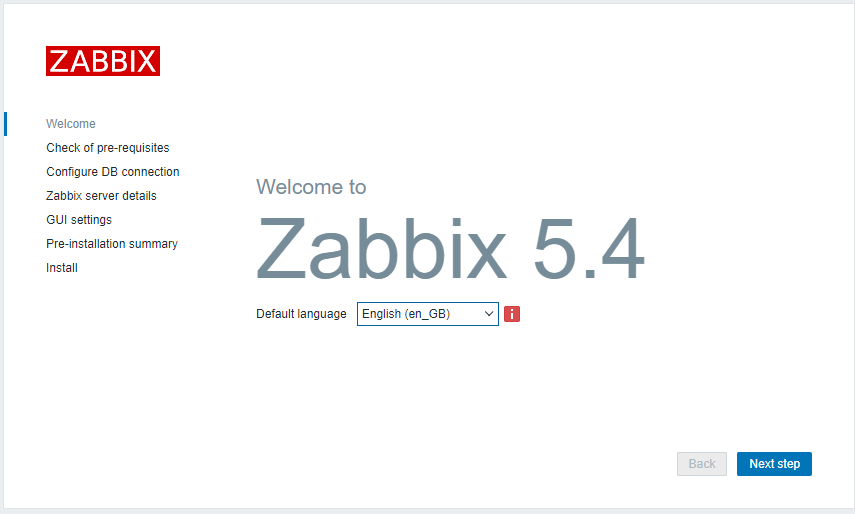

## ДЗ к Занятию 20
 
Prometheus, Zabbix 

## Задание 1

Настроить дашборд с 4-мя графиками: память, процессор, диск, сеть.

Настроить на одной из систем: zabbix (использовать screen (комплексный экран)), prometheus - grafana.

В качестве результата прислать скриншот экрана - дашборд должен содержать в названии имя приславшего.

## Решение задания 1

### 1. Развертывание стенда мониторинга Zabbix.

Стенд мониторинга включает в себя 3 ВМ. 
 BM1 - СУБД Postgres c бд для работы Zabbix (IP - 192.168.11.131)
 ВМ2 - Apache+Zabbix (IP - 192.168.11.132)
 BM3 - WordPress как тестовый сервер. (IP - 192.168.11.124)
 
Развертывание и настройка контура Zabbix (BM1 + BM2) и машины для настройки мониторинга (ВМ3) выполняется с помощью vagrant c  использованием vagrantfile и соответствующих конфигурационных файлов. 
Для контура zabbix все необходимое размещено в каталоге - vagrant_vm_zabbix, для ВМ3 в каталоге - vagrant_wordpress.
После окончания процедуры развертывания контура Zabbix нужно ввести в браузере: http://192.168.11.132/zabbix. 

После чего отобразиться окно в котором выполнить окончательную настройку Zabbix.
 
 
 
 Основные параметры настройки:
 
    Сервер БД - 192.168.132
    БД: zabbix
    User:zabbix
    Password:zabbix
 
 Для входа нужно использовать учетную запись: Admin/zabbix
 
 После окончания развертывания ВМ3 для окончательной настройки необходимо подключиться по адресу: http://192.168.11.124/
 
  
 ### 2. Подключеные ВМ к Zabbix.
К системе мониторинга Zabbix были подключены 3 ВМ.

После подключения серверов к Zabbix пошел сбор данных

### 3. Комплексный экран для мониторинга ВМ3 (WordPress)

Дополнительно настроен мониторинг хостовой машины под управлением Windows.

 

